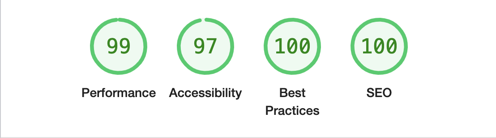

# Astro Blanding - a landing page for businesses

Astro Blanding is the template with which I begin for my clients' websites.

#### With a little time to meet the requirements of a client (less than a day):


## Get up and running (basics, required)
- Handle contact form in `src/pages/api/contact.ts`.
  - One way you can do this is with Slack:
  ```typescript
  import queryStringToJSON from "@utils/QueryStringtoJSON"; // This should be built in to JavaScript, but it is not.
  import { url } from "@utils/GetURL";

  export async function post({request}: {request: Request}) {
    const body = queryStringToJSON(await request.text())
    await fetch(import.meta.env.SLACK_NOTIFICATION_URL, {
      method: "POST",
      body: JSON.stringify({
        text: `${body.email} just requested a consultation for a website.\n${body.message.replace("+", " ")}`
      })
    })
    return Response.redirect(`${url}/success`, 307) // Note that this requires that you create a form success `/success` route.
  }
  ```
- Update information config in `src/config.ts`
- Deploy to Netlify (using NetlifyCMS) or another provider (you have to install your provider, _even Netlify_).
  - This requires that you add [Netlify](https://docs.astro.build/en/guides/integrations-guide/netlify/)
  `npx astro add netlify`

## Features

### Icons by [astro-icon](https://github.com/natemoo-re/astro-icon#readme)

Example:
```astro
---
import { Icon } from 'astro-icon'
---

<!-- Automatically fetches and inlines Material Design Icon's "account" SVG -->
<Icon viewBox="2 2 20 20" width="18" height="18" pack="fe" name="github" />

<!-- Should be this, but I think there are still some bugs in the provider -->
<Icon pack="mdi" name="account" />
```

### Contact form

Figuring out a contact form is annoying, so I have one preconfigured. You only need to handle what happens once the form is submitted. This is done in `src/pages/api/contact.ts`.

### OG Image Generation and Image Optimization (with lazy-loading) with Svelte component

Preconfigured API routes in the `src/pages/api/ab` directory (`ab` as an abbreviation for `astro-blanding`). Edit the HTML code in `src/pages/api/ab/og.ts` to generate custom OG images for your social links. Use the `Image` component from `@ab/Image.svelte` to have lazy-loaded images using [blurhash](https://blurha.sh/).

You can change default cache times for images and image previews in `src/config` in the `imageOptimization` property.

The `<Image />` Svelte component is inspired by NextJS's [image component](https://nextjs.org/docs/api-reference/next/image).

```astro
---
import Image from "@ab/Image.svelte";
---

<Image src="/github/lighthouse.png" width="300" height="200" alt="lighthouse scores" client:only="svelte" />
```

`<Image />` props

- `src` - _required_, `string` - a full or relative URL
  - eg: `https://github.com/an/image.png`, `/github/lighthouse.png`
- `width` - `number` - width of the image in pixels, _required_ unless `fill` prop is used
- `height` - `number` - height of the image in pixels, _required_ unless `fill` prop is used
- `alt` - _required_, `string` - used to describe the image for screen readers and search engines, if the image is purely decorative or not intended for the user, the alt property should be an empty string (eg: `alt=""`)
- `fill` - default: `false` - a boolean that causes the image to fill the parent element
  - The parent element must assign `position: "relative"`, `position: "fixed"`, or `position: "absolute"` style
- `style` - `string` - pass styles as a string, you may want to use this to set the [object-fit](https://developer.mozilla.org/en-US/docs/Web/CSS/object-fit) CSS property.
- `className` - `string` - pass HTML `class` via string
- `preview` - `string` - Blurhash preview (will speed up image preview, eg: if you save the preview in your database)