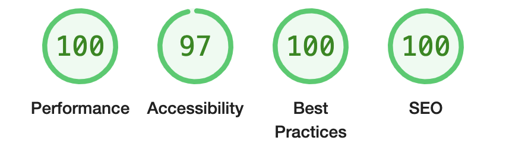

# Astro Blanding - a landing page for businesses

Astro Blanding is the template with which I begin for my clients' websites.

#### With a little time to meet the requirements of a client (less than a day):


## Get up and running (basics, required)
- Handle contact form in `src/pages/api/contact.ts`.
  - One way you can do this is with Slack:
  ```typescript
  import queryStringToJSON from "@utils/QueryStringtoJSON"; // This should be built in to JavaScript, but it is not.
  import { url } from "@utils/GetURL";

  export async function post({request}: {request: Request}) {
    const body = queryStringToJSON(await request.text())
    await fetch(import.meta.env.SLACK_NOTIFICATION_URL, {
      method: "POST",
      body: JSON.stringify({
        text: `${body.email} just requested a consultation for a website.\n${body.message.replace("+", " ")}`
      })
    })
    return Response.redirect(`${url}success`, 307) // Note that this requires that you create a form success `/success` route.
  }
  ```
- Update information config in `src/config.ts`
- Deploy to Netlify (using NetlifyCMS) or another provider (you have to install your provider, _even Netlify_).
  - This requires that you add [Netlify](https://docs.astro.build/en/guides/integrations-guide/netlify/)
  `npx astro add netlify`

## Features

### Icons by [astro-icon](https://github.com/natemoo-re/astro-icon#readme)

Example:
```astro
---
import { Icon } from 'astro-icon'
---

<!-- Automatically fetches and inlines Material Design Icon's "account" SVG -->
<Icon viewBox="2 2 20 20" width="18" height="18" pack="fe" name="github" />

<!-- Should be this, but I think there are still some bugs in the provider -->
<Icon pack="mdi" name="account" />
```

### Contact form

Figuring out a contact form is annoying, so I have one preconfigured. You only need to handle what happens once the form is submitted. This is done in `src/pages/api/contact.ts`.

### OG Image Generation and Image Optimization (with lazy-loading)

Preconfigured API routes in the `src/pages/api/ab` directory (`ab` as an abbreviation for `astro-blanding`). Edit the HTML code in `src/pages/api/ab/og.ts` to generate custom OG images for your social links. Use the `Image` component from `@components/ab/Image.svelte` to have lazy-loaded images using [blurhash](https://blurha.sh/).

The `<Image />` component is not perfect. Do not use it for first contentful paints, dynamically-sized images (eg: background images), or relative urls (you must use full urls).

```astro
  <Image src="http://localhost:3000/github/lighthouse.png" width="300" height="200" alt="Hi" client:only="svelte" />
```